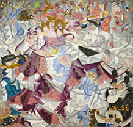
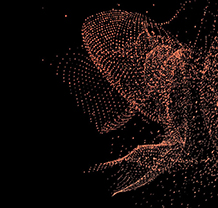

<!DOCTYPE HTML>
<html>
<head>
	<meta charset="UTF-8">
	<title>Transmissions Summer School</title>
	<link rel="stylesheet" href="css/style.css" type="text/css">
</head>
<body>
	

		
		<ul>
			<li>
				<a class="active" href="Index.html">Home</a>
			</li>
			<li>
				<a href="Chisiamo.html">Chi siamo</a>
			</li>
			<li>
				<a href="Programma.html">Programma</a>
			</li>
			<li>
				<a href="Mostra.html">Mostra</a>
			</li>
			<li>
				<a href="ContattiIscrizioni.html">Contatti/Iscrizioni</a>
			</li>
	  </ul>

	

	  

			

				<h1>10-18 settembre 2021</h1>
				<h1>&nbsp;</h1>
				<h1><strong>TRA(S)MISSIONI</strong></h1>
				
&nbsp;
				

				
Come la multimedialità forma e riforma la ricerca interdisciplinare nell'ambito dell'italianistica e della cultura visuale. 

				<h1>&nbsp;</h1>
				<h1>SUMMER SCHOOL</h1>
				<h1>&nbsp;</h1>
				
Università degli Studi Roma Tre
				

				
in collaborazione con il

				
Virtual Humanities Lab della 

				
Brown University

			

		

	

	

		

		  

			  
			  

				  La Summer School si svolgera' dal 10 al 18 settembre 2021 presso l'Universita' ROMA TRE di Roma. Il programma sara' diviso in lectures e workshops. Ci saranno visite guidate e attivita' ricreative presso la sede della scuola e in varie locations a Roma.

			

			<ul>
			  <li>
					<h3>PROGRAMMA</h3>
					

						

							Clicca per il calendario delle lectures e gli speakers.
					  

						<a href="Programma.html" class="more">via alla pagina</a>
					

					
				</li>
			  <li>
					<h3>ISCRIVITI</h3>
					

						

							Clicca per la lista completa degli workshops.
						

						<a href="ContattiIscrizioni.html.html" class="more">vai alla pagina</a>
					

					
				</li>
			  <li>
					<h3>CHI SIAMO</h3>
					

						

							Clicca per scoprire tutte le attivita'.
						

						<a href="Chisiamo.html" class="more">vai alla pagina</a>
					

					
				</li>
			  <li>
					<h3>MOSTRA</h3>
					

						

							Clicca per scoprire la mostra.
						

						<a href="Mostra.html" class="more">vai alla pagina</a>
					

					
				</li>
			</ul>
		

	

	

		

		  

			<h2>Multimedialità e interdisciplinarità</h2>
			  
La Summer School esplora il significato di interdisciplinarità e multimedialità utilizzando un approccio sinergico che unisce diverse metodologie provenienti dal campo delle Digital Humanities, dagli studi sulle culture digitali e dai metodi di ricerca incentrati sulla materialità dell’oggetto. Attraverso l’applicazione in forma laboratoriale dei dispositivi utilizzati in ambito umanistico-digitale, la Summer School avvicina i partecipanti alla conoscenza degli strumenti adatti all’individuazione delle relazioni tematiche che interessano il mondo computazionale dal punto di vista testuale, visivo e spaziale, così come si presenta nei diversi mezzi, forme e fonti letterarie e artistiche. L’inclusione di studiosi e artisti che operano in ambito internazionale, e provenienti da diversi settori, è vista in una chiave dialogica per allargare il dibattito intorno alle Digital Humanities e alle culture digitali, al fine di favorire un confronto tra metodologie diverse e procedure alternative. Attraverso una serie di incontri all’interno della cornice epistemologica della multimedialità, “Tra(s)missioni” offre la possibilità di confrontarsi con le trasformazioni che coinvolgono il campo dell’Italianistica, da intendersi nel suo significato più ampio dei Cultural Studies.

		  

		

	

	

		

			

				2020-2021 &copy; Transmissions Summer School. Photo credit: Elisa Giardina Papa | Website: <a href="http://www.elisagiardinapapa.org/">elisagiardinapapa.org</a>
			

			<ul>
			</ul>
		

	

</body>
</html>
